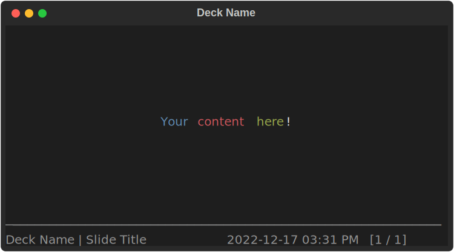
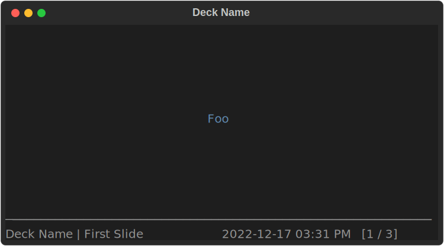
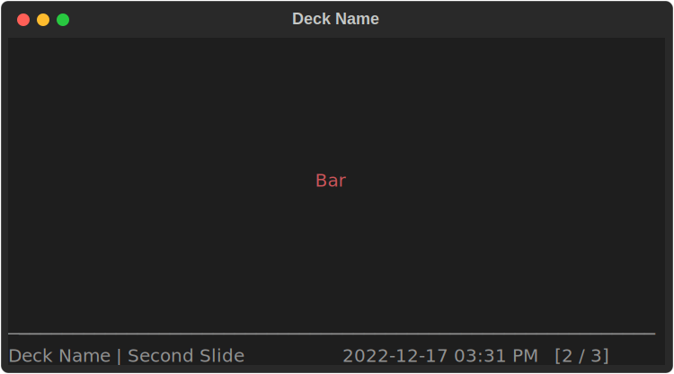

# Making Slides

## Slide Content

Each slide's content is rendered by calling a "content" function that returns a
[Rich `RenderableType`](https://rich.readthedocs.io/en/stable/console.html#printing).

There are two primary ways to define these content functions.
For unique slides you can use the [`Deck.slide`][spiel.Deck.slide] decorator:

```python
--8<-- "examples/slide_via_decorator.py"
```


You might also find yourself wanting to create a set of slides programmatically
(well, even more programmatically).
You can use the [`Deck.add_slides`][spiel.Deck.add_slides] function to add
[`Slide`s][spiel.Slide] that you've created manually to your deck.

```python
--8<-- "examples/slide_loop.py"
```





This pattern is useful when you have a generic "slide template"
that you want to feed multiple values into without copying a lot of code.
You have the full power of Python to define your slides,
so you can use as much (or as little) abstraction as you want.

## Triggers
